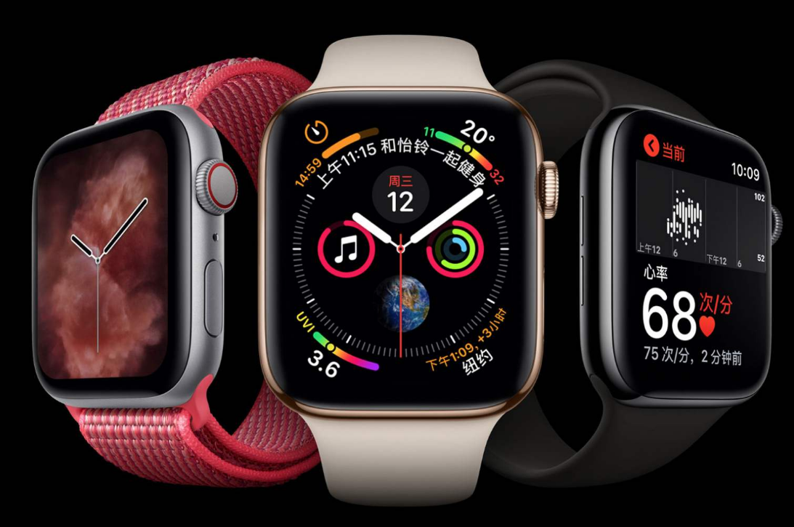
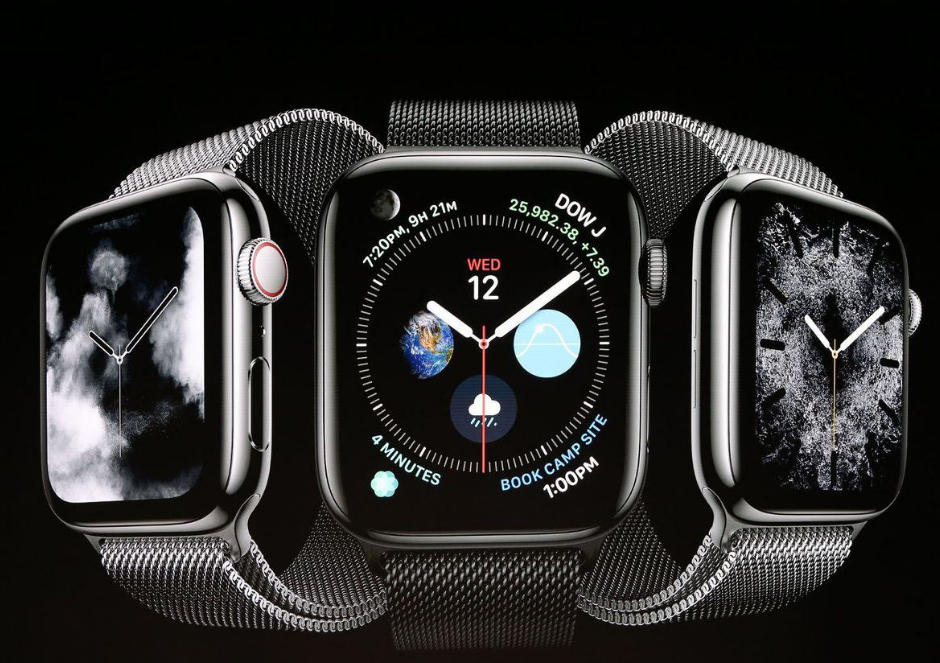
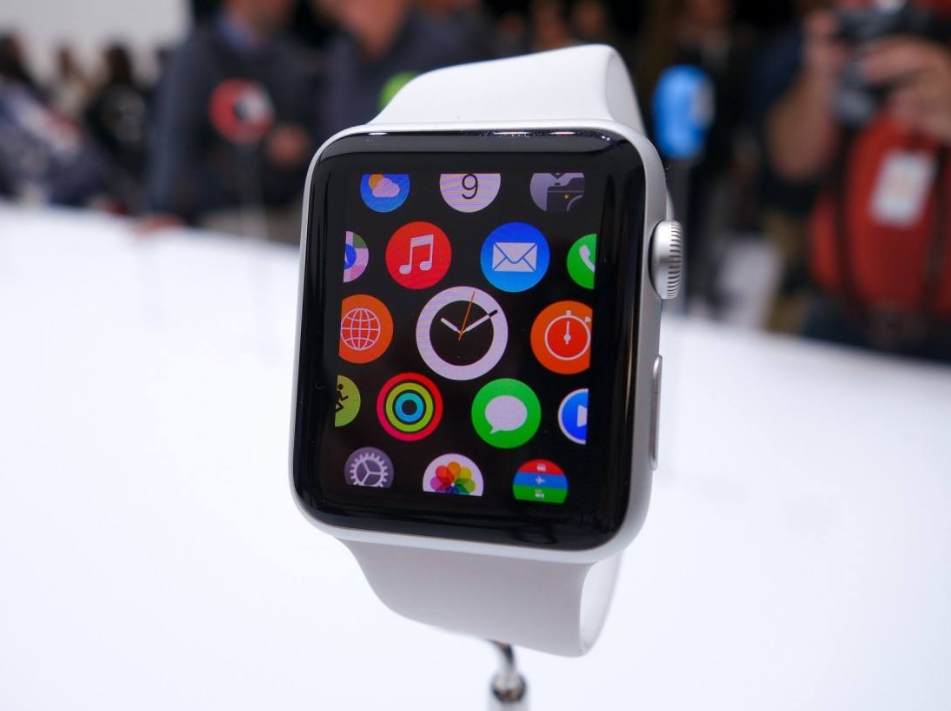
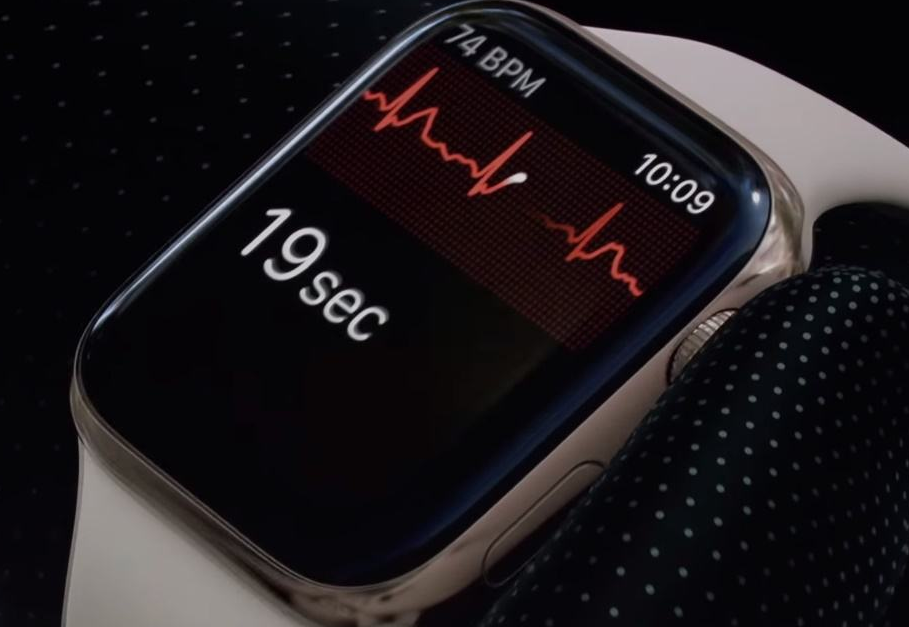
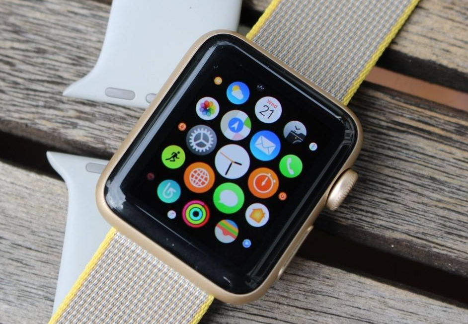

# 自从用了iWatch，生活变自律了，细节这块苹果做得很好

用了Apple Watch后，对生活有什么改变？有人说生活变得更加美好了，自从戴了apple watch后，一般除了没电，不然都是一直戴着，外形很好看，搭配各种衣服。然后功能特别好，比如跑步啊健身都戴着监督健身情况。回消息也特别好，微信有个只有apple watch才有的功能，信号提醒，特别好用，提醒好友回消息。洗澡的时候也可以回消息，听歌接电话，都不会漏掉。晚上睡觉戴着睡觉一点也不会影响，不觉得手上戴着东西，睡眠心率管理特别好。自从用了apple watch，生活变得更加自律了，细节这块，苹果就是做得特别好。

也有人说apple watch和Kindle是一个类型的东西，所起的作用类似。你大概率不会因为买了一个Kindle就喜欢上阅读，同样你也不会因为买了一个apple watch而喜欢运动。在运动这方面，apple watch确实可以带来不少便利，尤其是再搭配一个Air Pods，你会发生这绝对是运动的好帮手。但是apple watch所带来的正反馈，并不会督促你进行运动。有需求有钱的情况，可以去买一块来便利自己的生活，毕竟这表不仅仅能拿来运动。如果没有需求或需求不大，不建议购买以后再去培养需求。

负担：目前没有感觉到有不可接受程度的负担，要说和机械表、石英表等表比起来，最不方便的就是，使用超过两天必须要给它充一次电，没电的它就是个摆设。便利：更关注自己的运动和健康情况，手表买来后，也并不是每天都带，毕竟它只是一款在生活中起辅助作用的电子产品。但现在每次只要运动时，就会带它，有了它，更加关注自己的运动情况，也更喜欢去运动了。最典型的例子就是，每次爬山或徒步时必带它，它的步数记录要比iPhone的记录更准确。

作为一名996办公室社畜，好不容易可以亲近自然，放空自我锻炼身体时。一定要有一个准确数据记录，让人知道走了多少步，消耗了多少卡路里，拥有一种自我满足的快感。个人的感受是，在买了这款aw之后后知后觉，又去补了apple watch的初代发布会。发现aw的核心竞争点其实是3个：装饰属性，信息通知，健康检测。装饰属性和健康这两点我很喜欢，信息通知的话，可以看到我之前基本上没提，那些个什么微信通知都关了，因为我平时还是经常使用手机的，不需要用手表看消息。

如果以后有不方便的时候，再开就是了，苹果设备的多功能，很容易让人想物尽其用，但是在手表这个设备上，我建议还是做一点减法。最后，关于aw这个设备，其实并不是一个适合所有人的设备，脱离iPhone的话甚至都不能激活，连自家的air pods都不如。需要iPhone加需要你喜爱手表，这两点就已经是很高的门槛了，所以如果你不喜欢手表文化的话，其实并不建议无脑买aw，如果心水健康之类功能的话，买个基础版试试是个不错的选择（或者小米手环4）。而aw对比其他手表的话，有一定的错位优势，也有其劣势。至少对于我来说，带一个时间都不能精准走的机械表，还不如aw，至少aw颜值在我这是过关了。

