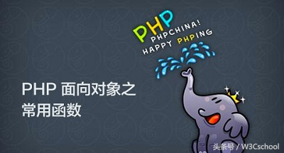
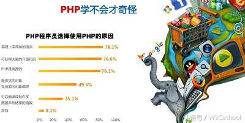
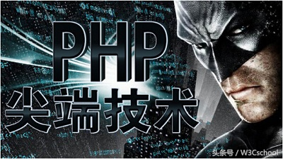

# 菜鸟必看，从零开始学php语言！

php是一种通用开源脚本语言,PHP独特的语法吸收了C语言.Java.Perl以及php自创的语法特点。PHP语言学习的门槛不高，即使是零基础的同学，只要勤于动手实践，也能由入门到精通。如果你是php语言的初学者，不妨和w3cschool小编了解一下Php是干什么用的，以及学习php从哪些方面入手。

**Php的用途是什么?**

对于一个php门外汉来说，对php语言存在着较浅的认识，他会觉得php语言就是做网站的。但是，更确切地说，php语言是网站后端开发以及后端处理的。因为这是一项技能，所以在学习php语言之前，大有必要搞清楚它是做什么的，这一点非常重要!

**php学习的框架**

下面w3cschool小编对学习PHP的过程做一下概括：

(1)熟悉HTML/CSS/JS等网页基本元素，完成阶段可自行制作完整的网页。

(2)理解动态语言的概念，运做机制，熟悉PHP语法。

(3)学习如何将PHP与HTML结合起来完成简单动态页面。

(4)接触MYSQL，设计数据库程序。

(5)不断巩固，摸透大部分PHP常用函数，并可理解OOP，MYSQL优化，模板。

(6)建立一个功能齐全的动态站点。

这整个的学习过程是循序渐进的过程，就拿html来说，只有当你先学会了制作网页，才能为之后建立网站打下基础。

**学习php语言会遇到的问题**

对于一个零基础的php初学者来说，学习过程难免会碰到各种各样的问题，w3cschool小编在此特别做出说明。

就以html学习为例，在学习过程比较常见的问题就是,看了手册中的各种概念，但是回想起来概念相当模糊和零碎。然而，php语言的学习并非知识型的，而是技能型的。所以，对于手册里每一个标签，每一个属性都敲了一遍，看看它们的效果和反应，这样对概念的认识显然会更深刻一些。像html和css的任何元素标记，这些都要亲自动手。

另外，在自学的过程中，一个人的视野是有限的，因而仍然需要找些教程视频来看。观看这些视频，你可以发现自己学习当中的遗漏和未曾注意的细节问题。像学习html的一样，一定要克服惰性，最好建立一个文本，专门用于记录不懂的一些问题，这样有利于你继续前进。

**搞点项目开发**

编程在刚接触有会有些新鲜感，但是接下来就是一些乏味感，因而需要寻找一些刺激。搞点项目开发，当你发现编程可以解决生活实际问题，将获得满满的成就感，这也你继续学习的动力源泉之一。当你学会HTML的时候，就可以编好几个大表格排板的网页;当你学会PHP，就可以把一加一的运算写在函数里，然后调用啦。当然，最好做一个留言板，和hello world PK一下!

作为一名学习php语言新手的你，在学习过程中还遇到什么问题呢?