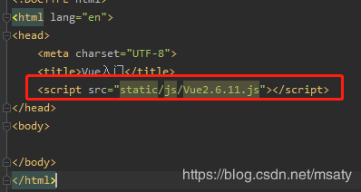
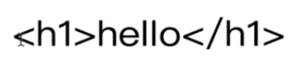
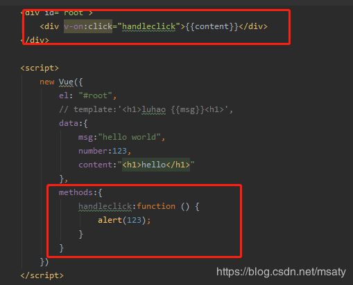
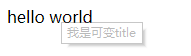
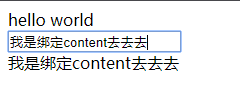
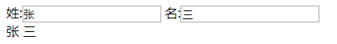
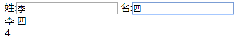
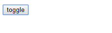
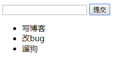
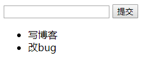

# Vue-10分钟掌握Vue

## 1.Vue官网

https://cn.vuejs.org

## 2.引入

通过script标签引入vue时最好放在head里，避免抖屏的情况。

> Tips：抖屏是指页面稍微大些，刷新页面会出现{{ }}的样式十分丑陋



## 3.实例

元素通过**id** 和new Vue对象的 **el** 进行绑定，该id对应一个**挂载点**，Vue实例只会处理挂载点的内容；**模板**是指可以将挂载点的内容写入**template**标签中，同样会生效。

> {{msg}} 这样的语法叫做差值表达式，表示将某元素插入到页面中


```xml
<div id="root"><h1>luhao {{msg}}<h1></div>
<script>
        new Vue({        
              el: "#root",  
              // template:'<h1>luhao {{msg}}<h1>',
              data:{            
                        msg:"hello world" ，
                        number:123
                     }    
                  })
</script>

```

1.v-text：直接在页面上显示


```xml
<h1 v-text="number">
</h1>

```

text效果：



2.v-html：以html在页面上显示


```xml
<h1 v-html="number">
</h1>

```

html效果：


3.点击触发事件 v-on:click



v-on:click=“点击触发的方法名”，再在methods中写上对应的方法名称，即可完成点击触发事件

> v-on 可以简写成 @

4\. v-bind: 属性绑定


```xml
<div id="root">    
    <div v-bind:title="title">hello world</div></div>
<script>    
new Vue({        
    el: "#root",        
    data:{            
        title:"我是可变title"        
    } 
})
</script>

```

当需要进行**数据对象绑定**时，比如将title与data中的title绑定，需要用到**v-bind**指令。

效果如下：



> v-bind: 可以简写成 :

5.双向数据绑定 v-model

属性绑定只是单向属性绑定，并不能通过页面改变Vue对象里的值，如果要实现双向的数据绑定，可以通过给v-model


```xml
<div id="root">    
    <div v-bind:title="title">hello world</div></div>
    <input v-model="content"/>
    <div>{{content}}</div>
<script>    
new Vue({        
    el: "#root",        
    data:{            
        title:"我是可变title"，
        content:"我是绑定content"
    } 
})
</script>

```

效果如下：



6.计算属性 computed

当需要对多个值进行计算时，可以使用computed获取最终结果。例如：要获得全名，将姓和名拼接起来。


```xml
<div id="root">    
    姓:<input v-model="firstName"/>
    名:<input v-model="lastName"/>
    <div>{{fullName}}</div>
    <div>{{count}}</div>
<script>    
new Vue({        
    el: "#root",        
    data:{            
        firstName:'',
        lastName:''，
        count:0
    } ，
    computed:{    
        fullName:function () {       
            return this.firstName + ' ' + this.lastName    
    }，
    ,watch:{   
            firstName:function () {        
                this.count++    },    
           lastName:function () {        
           this.count++    }
           }
   }
})
</script>

```

效果如下：



7.侦听器 watch

当需要对某个对象的改变进行侦听时，可以通过watch来完成。例如：要计算姓和名改变的次数。（代码见6：计算属性）

效果如下：



8.条件判断 v-if

当需要通过点击按钮对div内的对象进行判断时，如果对象为显示状态就隐藏起来，如果对象是隐藏状态就显示它，可以通过v-if来处理。


```xml
<div id="root">    
    <div v-if="show">hello world</div>
    <button @click="handleClick">toggle</button>
</div>
<script>    
new Vue({        
    el: "#root",        
    data:{            
        show:true
    } ，
    methods:{
        handleClick: function () {       
           this.show = !this.show;
           }
    }
})
</script>

```

效果如下：

点击前：


点击后：



##### 9.显示和隐藏 v-show

当需要对元素进行显示和隐藏时，可以通过v-show来实现，基本功能和v-if类似，但是不会销毁dom上的对象，只是将其隐藏起来，相当于加了一个display:none的属性，和v-if相比性能较高，如果是需要频繁切换隐藏显示状态的元素，使用v-show比较好。

<div v-show="show">hello world</div>

10.遍历 v-for

当需要遍历一个列表里的值时，可以用v-for。index为每个元素的编号，可以作为key值，::key可以提升数据加载的效率。


```xml
<div id="root">    
    <ul>
        <li v-for="(item,index) of list" :key="item">{{item}}</li>
   </ul>
</div>
<script>    
new Vue({        
    el: "#root",        
    data:{            
        list:[1,2,3]
    } 
})
</script>

```

## 4.实现简易TodoList

TodoList：相当于一个任务列表，要实现的功能是通过页面添加删除任务列表。具体实现可以查看代码以及注释，主要原理是通过发布订阅模式实现父组件和子组件的属性传值来对数组进行操作。


```xml
<!--组件化开发TodoList-->
<div id="root">
    <div>
        <input v-model="inputValue"/>
        <button @click="handleSubmit">提交</button>       <!--click事件-->
    </div>                                                <!--数据流转:inputValue -> list -> item -> content -->
    <ul>
        <!--content中的内容是从list中遍历出来的，通过属性从父组件向子组件进行传值-->
        <todo-item
                v-for="(item,index) of list"
                :key="index"
                :content="item"
                :index="index"
                @delete="handleDelete"
        >
         <!--父组件监听子组件delete事件，当触发delete事件时，进行handleDelete操作，此处用到了【发布订阅模式】-->
        </todo-item>
    </ul>
</div>
<script>
    Vue.component('todo-item', {                        //子组件(全局组件：可以在任何地方使用)
        props: ['content', 'index'],                    //接受从外部传来的与名字对应的值
        template: '<li @click="handleClick">{{content}}</li>',
        methods: {
            handleClick: function () {
                this.$emit('delete', this.index)        //向外【发布】触发事件delete，并且该事件携带了index值
            }
        }
    })

    new Vue({                                           //父组件
        el: "#root",
        data: {
            inputValue: '',
            list: []
        },
        methods: {
            handleSubmit: function () {
                this.list.push(this.inputValue)         //点击提交后将数据加入到数组中
                this.inputValue = ''                    //清空输入框的值
            },
            handleDelete: function (index) {
                this.list.splice(index, 1)              //删除数组中下标为index的1条数值
            }
        }
    })
</script>

```

实际效果：

增加list:



点击后删除：

